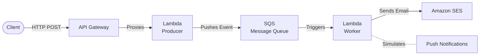

# 🚀 Serverless Event-Driven Notification System


## 📌 Overview

A scalable, event-driven notification system built using AWS serverless services.

This project demonstrates how to design a decoupled backend system using queues and asynchronous processing. Designed to mimic real-world distributed systems using AWS serverless architecture.


## 🏗️ Architecture



**Client → API Gateway → Lambda (Producer) → SQS → Lambda (Worker) → SES**


## ⚙️ Why This Architecture?
- **SQS →** Decouples services and improves reliability by buffering requests.
- **Lambda →** Scales automatically with demand, meaning zero idle server costs.
- **Event-driven design →** Enables asynchronous processing, so the client receives a lightning-fast response without waiting for the email dispatch.

## 🔄 Flow
1. **Intake:** Client sends a request to the API.
2. **Validation:** API Lambda validates the payload and pushes a message to SQS.
3. **Queueing:** SQS holds the message securely until a worker is ready.
4. **Processing:** Worker Lambda consumes messages in batches.
5. **Delivery:** The notification is processed and sent via SES.

## 🚀 Features
- **Event-driven architecture**
- **Asynchronous processing** using SQS
- **Email notifications** using AWS SES
- **Modular and scalable design**
- **Clean separation of concerns**
- **Automatic Retries:** Built-in logic to retry transient email delivery failures.

## 🧠 Design Decisions
- **Queue-based system:** Crucial for reliability and scalability to handle sudden traffic spikes without overwhelming downstream APIs.
- **Stateless Lambda functions:** Better scaling and fully managed execution.
- **Service-based modular structure:** Mimics production repositories ensuring maintainability and ease of testing.

## ⚠️ Failure Handling (Concept)
- **Automatic Retries:** Messages can be retried automatically if processing fails.
- **Dead Letter Queues (DLQ):** The system can be extended using DLQs to catch persistent connection issues (poison pill messages) guaranteeing zero data loss.

## 📂 Project Structure

```text
src/
├── handlers/         # Lambda entry points (API and Worker)
├── services/         # Core business logic (Email, Notification, SQS integration)
└── utils/            # Shared tools (Logging, Configuration, Validation)
```

## 📊 Inspired By

This project is inspired by a real-world production system I built and is recreated in a simplified form.

## 🚀 Future Improvements
- Add DLQ support natively to capture persistent failures.
- Add real push notifications (e.g., FCM/APNs).
- Add an authentication layer.
- Add monitoring dashboards (CloudWatch integration).
