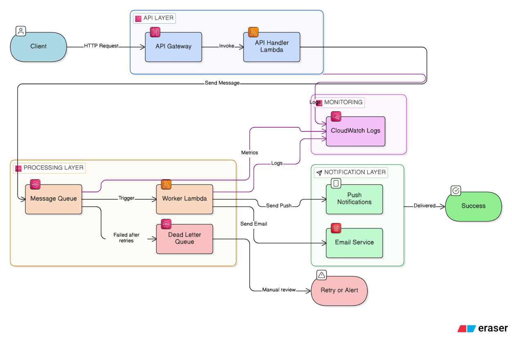

# 🚀 Serverless Event-Driven Notification System

> A production-inspired serverless notification system demonstrating decoupled, event-driven architecture using AWS.  
> This project is a simplified version of a real-world system built for a production client application.

---

## 📌 Overview

A scalable, event-driven notification system built using AWS serverless services.

This project demonstrates how to design a **decoupled backend system** using queues and asynchronous processing. It mimics real-world distributed systems and highlights best practices for building reliable and scalable backend services.

---

## ⚙️ Tech Stack

- **Backend:** Python (AWS Lambda)
- **Cloud Services:** AWS Lambda, API Gateway, SQS, SES
- **Architecture:** Serverless, Event-Driven
- **SDK:** Boto3

---

## 🏗️ Architecture Overview

The system follows an event-driven, decoupled architecture using AWS managed services.



---

## 🔄 System Flow

1. Client sends request to API Gateway  
2. API Lambda validates input and **enqueues** message to SQS  
3. SQS acts as a **buffer** for asynchronous processing  
4. Worker Lambda **consumes** messages from SQS  
5. Email notification is sent via AWS SES  

---

### 💡 Key Design Highlights

- Decoupled architecture using SQS  
- Asynchronous processing for scalability  
- Serverless design using AWS Lambda  
- Fault isolation and improved reliability  
- Horizontal scalability via Lambda concurrency and queue-based load leveling  

---

## ⚙️ Why This Architecture?

- **SQS →** Decouples services and improves reliability by buffering requests  
- **Lambda →** Scales automatically with demand, eliminating idle infrastructure  
- **Event-driven design →** Enables asynchronous workflows and faster client response times  

---

## 🚀 Features

- Event-driven architecture  
- Asynchronous processing using SQS  
- Email notifications using AWS SES  
- Modular and scalable code structure  
- Clean separation of concerns  
- Automatic retry handling for transient failures  

---

## 🧠 Design Decisions

- **Queue-based system:** Handles traffic spikes and prevents system overload  
- **Stateless Lambda functions:** Enable efficient scaling and simplified deployments  
- **Service-based modular structure:** Improves maintainability and testability  

---

## ⚠️ Failure Handling

- Messages are processed asynchronously via SQS
- If processing fails, messages are retried automatically
- Failed messages can be routed to a Dead Letter Queue (DLQ) for further analysis

---

## 📈 Scalability

- AWS Lambda automatically scales based on incoming traffic
- SQS acts as a buffer to handle traffic spikes
- The system can process multiple messages in parallel

---

## ⚖️ Tradeoffs

- Asynchronous processing introduces slight latency
- Additional AWS services increase system complexity
- Requires proper monitoring and logging

---

## 📬 Sample API Request

`POST /notify`

```json
{
  "email": "test@example.com",
  "message": "Hello from system"
}
```
